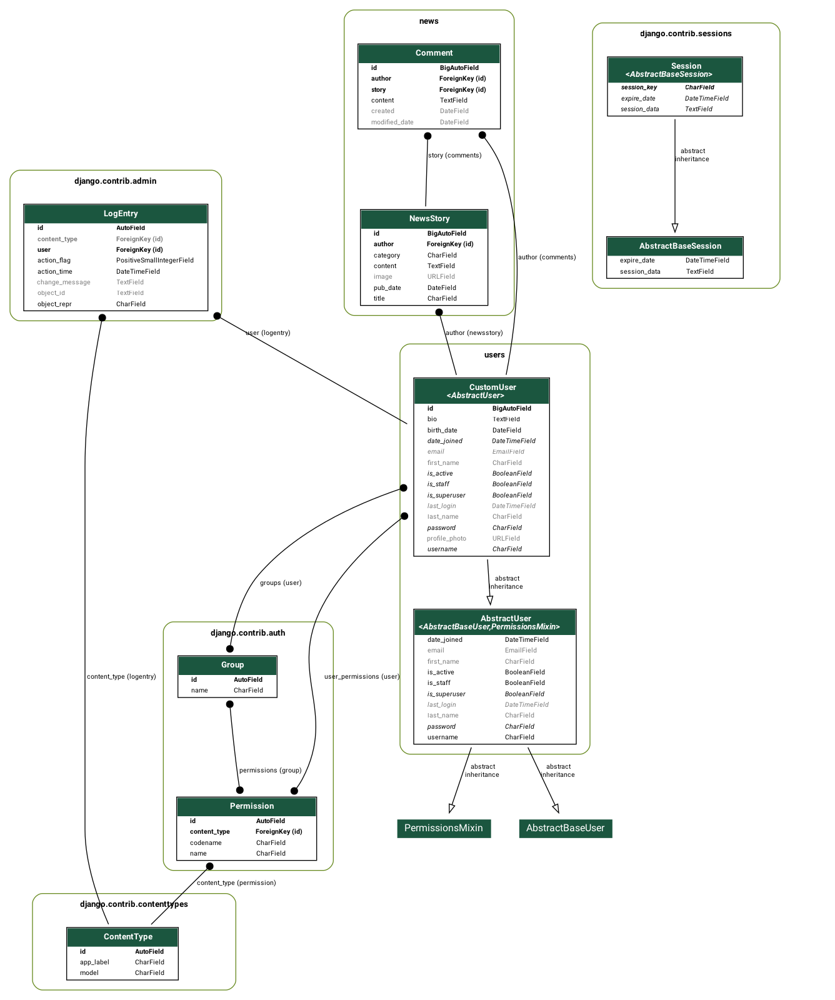
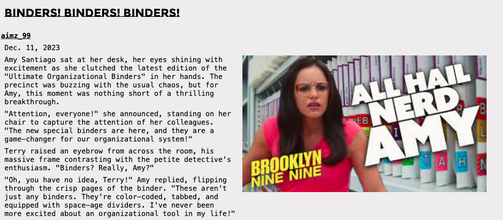
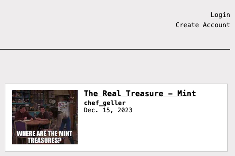
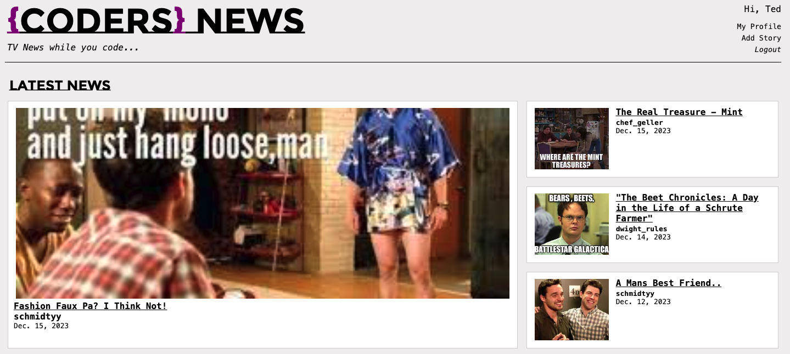
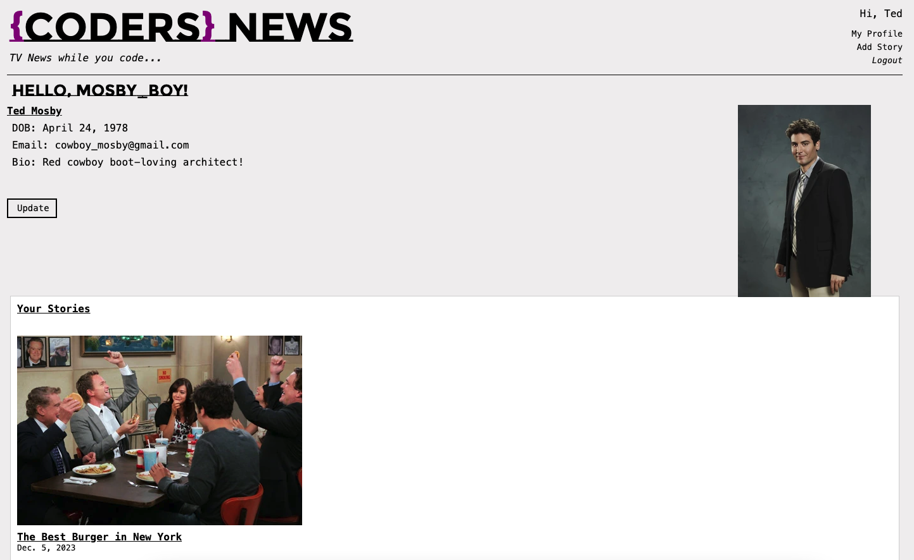
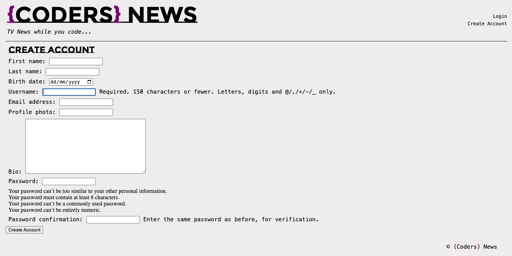
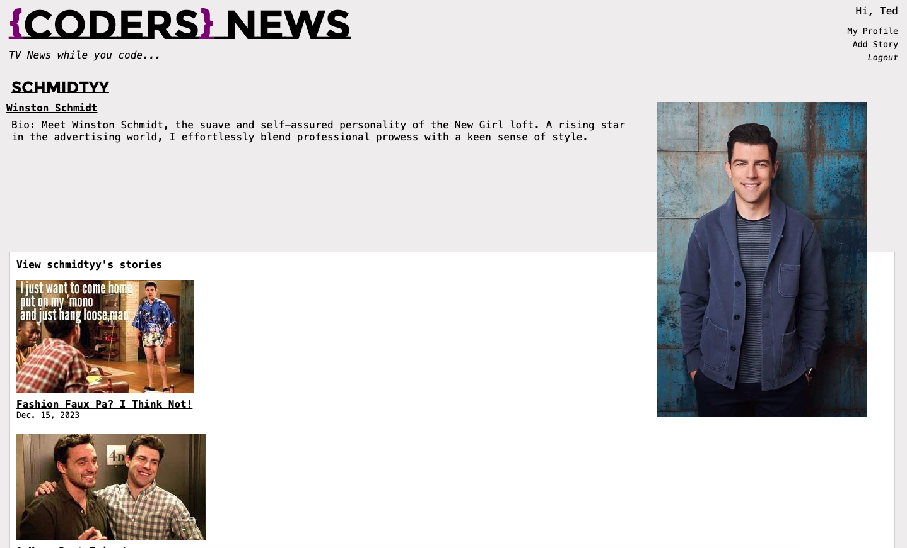
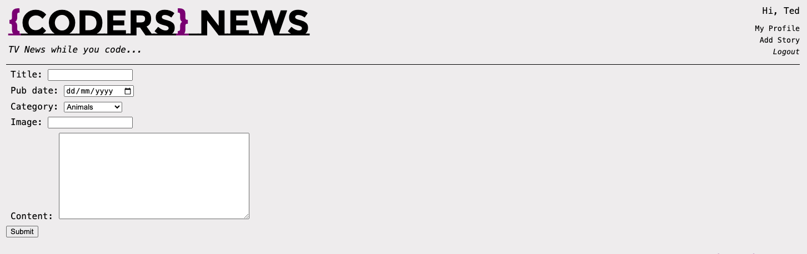
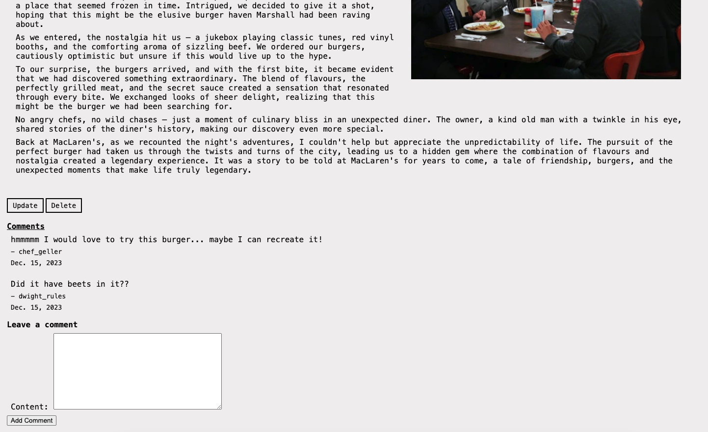

# Sandra Lopez - She Codes News

## About This Project
This is a News story webiste created using Django as a project for the She Codes Plus Program. 
The theme of my website was inspired by the TV shows I was watching while learning Django.

## How To Run This Code

1. Clone repo - Make sure you clone the repo into the right place
2. Create and activate your Virtual environment (venv)
3. Migrate the database `python manage.py migrate`
4. Open the repo from your terminal and run the server using `python manage.py runserver`
5. Create a user account or log in and enjoy using {Coders} News
6. User Account details provided below

## Database Schema

## Project Features
- [x] Order stories by date
    

- [ ] Styled "new story" form

- [x] Story images
    

- [x] Log-in/log-out
    

    

- [x] "Account view" page
    

- [x] "Create Account" page
    

- [x] View stories by author
    

- [x] "Log-in" button only visible when no user is logged in/"Log-out" button
        only visible when a user *is* logged in
        

- [x] "Create Story" functionality only available when user is logged in 

## Additional Features:
- [ ] Add categories to the stories and allow the user to search for stories by
        category.

- [x] Add the ability to update and delete stories (consider permissions - who
        should be allowed to update or and/or delete stories).
    

- [ ] Add the ability to “favourite” stories and see a page with your favourite
        stories.

- [ ] Our form for creating stories requires you to add the publication date,
        update this to automatically save the publication date as the day the
        story was first published (maybe you could then add a field to show
        when the story was updated).
         

Test accounts 1
username: test_test - password: hellotest

username: Ted Mosby - password: robinsparkles

username: aimz_99 - password: coolcoolcoolcool

username: chef_geller - password: minttreasures

username: schmidtyy - password: nickismyfave

username: dwight_rules - password: beetsbearsbattle
